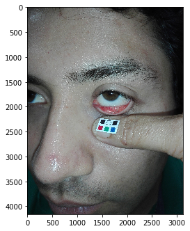
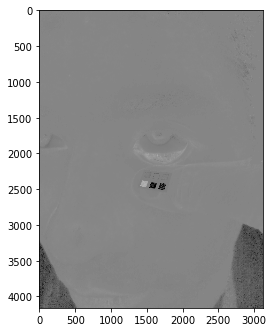

# Erythema index and calibration using white for relationship between conjunctiva color and Hemoglobin

Library to extract the erythema index (EI) given the polygon coordinates of a square of calibration and the conjuctiva. Based on the paper: **Collings S, Thompson O, Hirst E, Goossens L, George A, Weinkove R (2016) NonInvasive Detection of Anaemia Using Digital Photographs of the Conjunctiva. PLoS ONE 11(4): e0153286. doi:10.1371/journal.pone.0153286**


```python
import numpy as np
import pandas as pd
from PIL import Image
import os
from matplotlib.path import Path
import matplotlib.pyplot as plt
import imp

import conj_erithema_index
imp.reload(conj_erithema_index)
from conj_erithema_index import *
```

To define the conjunctiva and the square for calibration I have used **VGG anotator** (www.robots.ox.ac.uk/~vgg/software/via/via.html)   
* Upload the image or images you want to work with. 
* Create a polygon to surround the conjunctiva.  
* Create a polygon to surround the white color of a reference pallet.  
* Download the information as **json**. **Tools panel/Annotation/Save as JSON**  
* Define a folder where the json file is located. In my case it is **Individual/**.   
  
My images are also in the **Individual/** folder. The following lines create a pandas dataframe to load the json and then extract the polygons. The default parameters will expect the conjunctiva to have 11 points (10 + 1 to close the polygon). Also 5 points for the square (4 + 1 for closing the polygon). If different change the **conj_erithema_index.points** function.  

Finally, we see the output of some lines to see the dataframe is working fine.


```python
polygons = 'Individual/via_region_data.json'
dfx = pd.read_json(polygons)
dfx = dfx.transpose()
print(dfx.columns)

expected_regions = 2
for _ in range(0,dfx.shape[0]):
    k = dfx['regions'][_].keys()
    print(len(k))
    
dfx = dfx[dfx['regions'].apply(lambda x: len(x.keys()))==expected_regions]


points_df = pd.DataFrame(list(dfx['regions'].apply(points,sufix='_polygon').values))
points_df.columns

dfx['fullpath']='Individual/'+dfx['filename']

imp_cols = ['filename','fullpath']

dfx = dfx.reset_index()[imp_cols]
dfx = pd.concat([dfx,points_df],1)
print(dfx.columns)
dfx.head(2)
```

    Index(['base64_img_data', 'file_attributes', 'filename', 'fileref', 'regions',
           'size'],
          dtype='object')
    2
    0
    2
    2
    2
    Index(['filename', 'fullpath', 'p_polygon', 'px0', 'px1', 'px10', 'px2', 'px3',
           'px4', 'px5', 'px6', 'px7', 'px8', 'px9', 'py0', 'py1', 'py10', 'py2',
           'py3', 'py4', 'py5', 'py6', 'py7', 'py8', 'py9', 's_polygon', 'sx0',
           'sx1', 'sx2', 'sx3', 'sy0', 'sy1', 'sy2', 'sy3'],
          dtype='object')


<div>
<table border="1" class="dataframe">
  <thead>
    <tr style="text-align: right;">
      <th></th>
      <th>filename</th>
      <th>fullpath</th>
      <th>p_polygon</th>
      <th>px0</th>
      <th>px1</th>
      <th>px10</th>
      <th>px2</th>
      <th>px3</th>
      <th>px4</th>
      <th>px5</th>
      <th>...</th>
      <th>py9</th>
      <th>s_polygon</th>
      <th>sx0</th>
      <th>sx1</th>
      <th>sx2</th>
      <th>sx3</th>
      <th>sy0</th>
      <th>sy1</th>
      <th>sy2</th>
      <th>sy3</th>
    </tr>
  </thead>
  <tbody>
    <tr>
      <th>0</th>
      <td>Bryan_L_IMG_20180315_130109_BURST001_COVER.jpg</td>
      <td>Individual/Bryan_L_IMG_20180315_130109_BURST00...</td>
      <td>[(1472, 1976), (1604, 2004), (1724, 2008), (18...</td>
      <td>1472</td>
      <td>1604</td>
      <td>1472</td>
      <td>1724</td>
      <td>1856</td>
      <td>1956</td>
      <td>1956</td>
      <td>...</td>
      <td>2028</td>
      <td>[(1619, 2291), (1669, 2299), (1653, 2349), (16...</td>
      <td>1619</td>
      <td>1669</td>
      <td>1653</td>
      <td>1605</td>
      <td>2291</td>
      <td>2299</td>
      <td>2349</td>
      <td>2339</td>
    </tr>
    <tr>
      <th>1</th>
      <td>Gladys_R_IMG_20180315_130557_BURST001_COVER.jpg</td>
      <td>Individual/Gladys_R_IMG_20180315_130557_BURST0...</td>
      <td>[(1288, 693), (1147, 744), (1043, 765), (941, ...</td>
      <td>1288</td>
      <td>1147</td>
      <td>1288</td>
      <td>1043</td>
      <td>941</td>
      <td>840</td>
      <td>821</td>
      <td>...</td>
      <td>765</td>
      <td>[(942, 1268), (1018, 1264), (1026, 1320), (954...</td>
      <td>942</td>
      <td>1018</td>
      <td>1026</td>
      <td>954</td>
      <td>1268</td>
      <td>1264</td>
      <td>1320</td>
      <td>1334</td>
    </tr>
  </tbody>
</table>
<p>2 rows × 34 columns</p>
</div>


## Get the Erythema index

First create the object specifing, the column that has the fullpath to your image, the image_index to work with, the column that has the polygon for the square (square_poly_col), the column that has the conjunctiva polygon (conj_poly_col), the reference factor (From the paper it is 200) and an epsilon value to avoid log division by zero.  
Next, create a template image. This will create an "empty" image of the same size of the image of image_index. But having tuples of every coordinate of pixels. The bigger the image, the longer it will take. If all your images have the same size, just use **generate_template_image** once.


```python

cei = Conjunctiva_ei(dfx,filename_col='fullpath',image_index=0,square_poly_col='s_polygon',
               conj_poly_col='p_polygon',reference_factor=200,epsilon=1e-6)

cei.generate_template_image(v=True)

```

    Opening image: Individual/Bryan_L_IMG_20180315_130109_BURST001_COVER.jpg
    Creating image template of size: (4160, 3120, 3)


Calculate the EI quickly. cei.EI has the numpy array that contains the EI values inside the conjunctiva.


```python
cei.calc_EI(v=False)
print("EI mean:",cei.EI_mean)
```

    EI mean: 33.9863616458


If you want to see the debugging process set v=True


```python
cei.calc_EI(v=True)
```

    [ 1.08679839  0.84126574  0.79224474]
    red stats. Mean: 170.058698595 max: 255.0 min: 55.4267181256
    green stats. Mean: 83.9695599739 max: 214.522763856 min: 0.0
    red log stats. Mean: 236.103395188 max: 255.00000018 min: 184.766659005
    green log stats. Mean: 202.117033542 max: 247.045828773 min: 0.0
    EI stats. Mean: 33.9863616458 max: 193.754452244 min: 7.95417140744
    EI mean: 33.9863616458


If you want to get the images, with and without EI. process **calc_EI_and_image**


```python
cei.calc_EI_and_image(v=True)
print("EI mean:",cei.EI_mean)
```

    [ 1.08679839  0.84126574  0.79224474]
    red stats. Mean: 111.347302492 max: 255.0 min: 0.0
    green stats. Mean: 87.0175756249 max: 214.522763856 min: 0.0
    red log stats. Mean: 202.740313488 max: 255.00000018 min: 0.0
    green log stats. Mean: 195.511283013 max: 247.045828773 min: 0.0
    EI stats. Mean: 7.22903047532 max: 231.236796438 min: -227.842376747
    EI conj stats. Mean: 33.9863616458 max: 193.754452244 min: 7.95417140744
    Image loaded into self.np_image. EI image loaded into self.ei_image


```python
cei.show_np_image()
```





```python
cei.show_ei_image()
```




